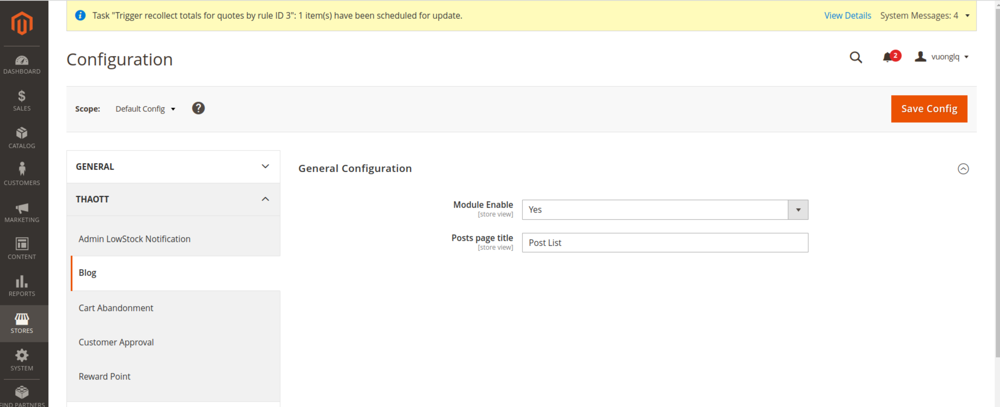
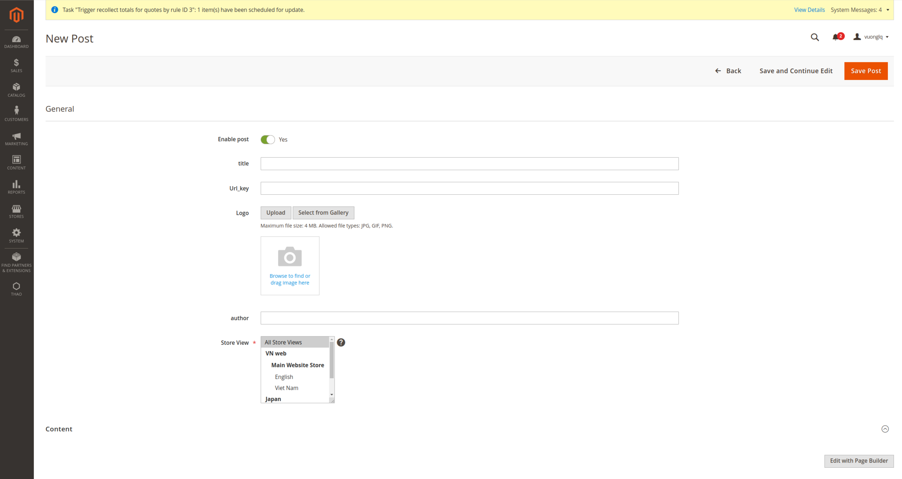
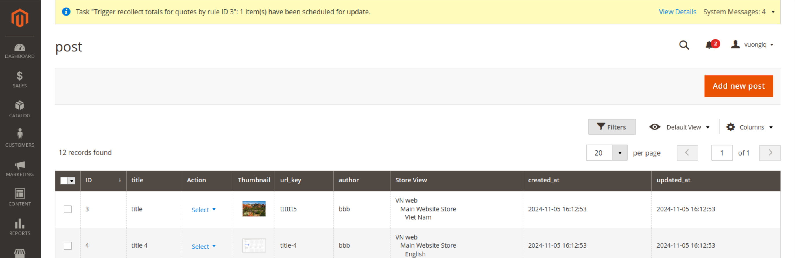
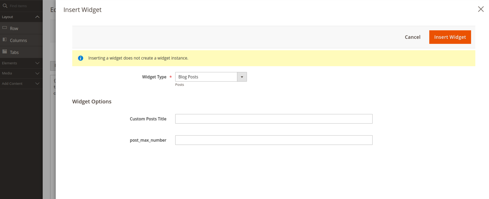

# Thao_Blog Module for Magento 2

## Introduction
`Thao_Blog` is a module for Magento 2 that allows you to easily create and manage a blog on your website. This module provides features such as:
- Managing blog posts (create, edit, delete)
- Displaying blog posts on the frontend
- SEO-friendly URLs

## System Requirements
- Magento 2.4+
- PHP 7.4 or higher

## Installation
You can install the `Thao_Blog` module in two ways: using Composer or manually via the `app/code` directory.

### Method 1: Install via Composer
```sh
composer config repositories.thao-blog git https://github.com/Tothao/Thao_Blog.git
composer require thao/module-blog:dev-master
php bin/magento setup:upgrade
php bin/magento setup:di:compile
php bin/magento cache:flush
```

### Method 2: Manual Installation
1. Download or clone the repository:
   ```sh
   git clone https://github.com/Tothao/Thao_Blog.git app/code/Thao/Blog
   ```
2. Run the following commands to enable the module:
   ```sh
   php bin/magento setup:upgrade
   php bin/magento setup:di:compile
   php bin/magento cache:flush
   ```

## Configuration Guide

To configure the module, go to **Admin > Configuration > Thaott > Blog > General Configuration**.

### Available Settings:

- **Module Enable:** Enable/disable the module.
- **Posts Page Title:** Set the title for the blog post listing page.

### Configuration Screenshots



### Adding a New Blog Post
To create a new blog post, follow these steps:

1. Go to **Admin > Thao > Post**.
2. Click **Add New Post**.
3. Enter the post title, content, and other relevant details.
4. Click **Save** to publish the post.





### Adding Blog Posts Widget
You can add the **Blog Posts** widget to the homepage or any other page by following these steps:

1. Go to **Admin > Content > Pages**.
2. Select the page where you want to add the widget (e.g., Home Page).
3. Click **Edit** and go to the **Content** section.
4. Click **Insert Widget...**.
5. Select **Blog Post** from the widget list.
6. Configure the following options:
    - **Custom Posts Title:** Set the title for the blog post list.
    - **post_max_number:** Define the maximum number of blog posts to display.
7. Click **Save** and refresh the cache to apply the changes.



## Support
If you encounter any issues, please open an issue on GitHub or contact us.
